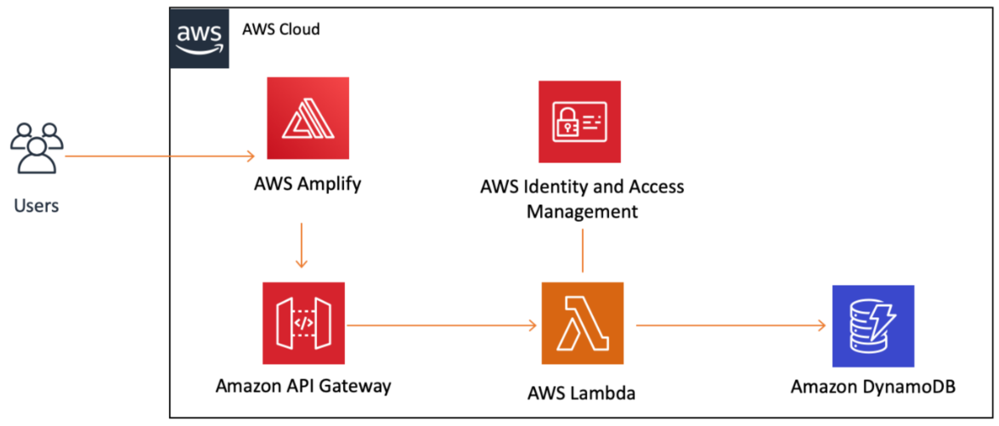

# AWS Application Deployment Project

This project involves deploying a web application on Amazon Web Services (AWS) using a variety of services including AWS Amplify, Amazon API Gateway, AWS Lambda, Amazon DynamoDB, and AWS Identity and Access Management (IAM). The application architecture is designed to leverage these services to create a scalable and efficient system.

## Overview

The project is divided into six modules, each focusing on a specific aspect of the deployment process. Each module builds upon the previous one, ensuring a structured and incremental approach to application development and deployment.

### Modules Overview

1. **Create Web App (AWS Amplify)**

   - Deploy static resources for the web application using AWS Amplify Console.
   - Host the web app on AWS Amplify.

2. **Build Serverless Function (AWS Lambda)**

   - Develop serverless functions using AWS Lambda.
   - Utilize JavaScript for writing Lambda functions.
   - Understand key concepts such as compute service, serverless functions, and Lambda triggers.

3. **Link Serverless Function to Web App (API Gateway)**

   - Create a RESTful API using Amazon API Gateway.
   - Define HTTP methods on the API.
   - Trigger Lambda functions from the API.
   - Enable CORS to allow cross-origin resource sharing.
   - Test the API using the AWS Management Console.

4. **Create Data Table (Amazon DynamoDB)**

   - Set up a DynamoDB table to persist application data.
   - DynamoDB is a key-value database service with consistent performance and minimal management overhead.
   - Configure IAM permissions to allow Lambda functions to interact with DynamoDB.
   - Utilize the AWS SDK (JavaScript) within Lambda functions for DynamoDB operations.

5. **Test the Web App**
   - Interact with the web application to invoke the API.
   - Call the API Gateway API from an HTML page.
   - Trigger Lambda functions to interact with DynamoDB.

## Key Concepts

Throughout the project, several key concepts are emphasized to facilitate understanding and effective implementation:

- **RESTful API**: Implementing the REST architectural pattern for creating web services.
- **HTTP Request Methods**: Utilizing HTTP methods like GET or PUT for communication between clients and servers.
- **CORS**: Enabling Cross-Origin Resource Sharing to allow web applications to access resources from different origins.
- **IAM Role-Based Access Control**: Managing permissions with IAM to securely control access to AWS resources.

## Project Architecture

## Getting Started

To begin with the project, follow the modules sequentially, completing each one before moving on to the next. Detailed instructions and guidance are provided within each module to facilitate smooth progress.

---

This README file provides an overview of the AWS application deployment project, outlining its modules, key concepts, and resources for further guidance. Following the structured approach outlined in the README will ensure a successful deployment of the web application on AWS.
